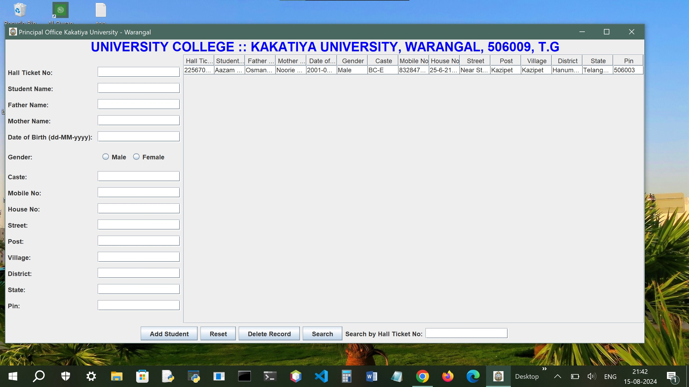

# University-Administration---Java-Student-Management-System
The University Administration project is a Java-based student management system designed for college administration. It allows users to manage student data, generate reports, and interact with an Oracle SQL database. Features include adding, deleting, searching, and updating student records, as well as exporting data to Excel.

## Description

University Administration is a Java-based application designed to manage student records for a college or university. The system allows administrators to perform essential functions such as adding, updating, deleting, and searching student records, as well as exporting student data into an Excel format.

This project is integrated with an Oracle SQL database for efficient data storage and retrieval. The user interface is built using Java Swing, and features such as generating reports and exporting to Excel are also provided.

## Features

- Add, delete, update, and search student records
- Export data to Excel
- Display current time and date in the application
- Generate reports for individual or all students
- Compatible with Oracle SQL Database 19c

## Prerequisites

- Java 8 or higher
- Oracle SQL Database 19c
- JDBC Driver for Oracle Database
- Apache POI (for Excel file generation)

## Installation

1. Clone the repository to your local machine:
   ```bash
   git clone https://github.com/your-username/UniversityCollege.git
2. Open the project in your favorite Java IDE (e.g., IntelliJ IDEA, NetBeans, Eclipse, or Visual Studio Code).

4. Set up your Oracle Database with the necessary student tables. Example SQL script: <br> 
   
CREATE TABLE students (  <br> 
    HALL_TICKET_NO VARCHAR2(255), <br> 
    STUDENT_NAME VARCHAR2(255), <br> 
    FATHER_NAME VARCHAR2(255), <br> 
    MOTHER_NAME VARCHAR2(255), <br> 
    DATE_OF_BIRTH DATE, <br> 
    GENDER VARCHAR2(10), <br> 
    CASTE VARCHAR2(255), <br> 
    MOBILE_NO VARCHAR2(20), <br> 
    HOUSE_NO VARCHAR2(25), <br> 
    STREET VARCHAR2(255), <br> 
    POST VARCHAR2(255), <br> 
    VILLAGE VARCHAR2(150), <br> 
    DISTRICT VARCHAR2(150), <br> 
    STATE VARCHAR2(80), <br> 
    PIN VARCHAR2(25) <br> 
); <br> 

ALTER TABLE students <br> 
MODIFY ( <br> 
    HALL_TICKET_NO VARCHAR2(20), <br> 
    STUDENT_NAME VARCHAR2(40), <br> 
    FATHER_NAME VARCHAR2(40), <br> 
    MOTHER_NAME VARCHAR2(40), <br> 
    GENDER VARCHAR2(6), <br> 
    CASTE VARCHAR2(20), <br> 
    MOBILE_NO VARCHAR2(15), <br> 
    HOUSE_NO VARCHAR2(10), <br> 
    STREET VARCHAR2(50), <br> 
    POST VARCHAR2(50), <br> 
    VILLAGE VARCHAR2(20), <br> 
    DISTRICT VARCHAR2(20), <br> 
    STATE VARCHAR2(20), <br> 
    PIN VARCHAR2(7) <br> 
); <br> 

5. Configure your JDBC connection in the Java project with the appropriate URL, username, and password.


## Application Preview



#How to Use
1. Run the Project: You can run the project by executing the UniversityCollege.java file.

2. Manage Student Records: Use the graphical user interface to manage student data. You can add, update, delete, and search records in the database.

3. Generate Reports: Use the "Generate Report" button to export all student data into an Excel file or generate a report for a specific student.

4. Export to Excel: Click the "Export" button to export the student records into an Excel spreadsheet.

## Code Overview
Main Classes:

UniversityCollege.java: The entry point of the application. It handles the graphical user interface and interaction with the Oracle database.


DatabaseConnection.java: This class manages the connection to the Oracle database using JDBC.

ExcelExporter.java: A utility class to handle exporting data to Excel format using Apache POI.

## Contributing
Feel free to contribute to this project by submitting a pull request or opening an issue if you find any bugs or have feature requests.
